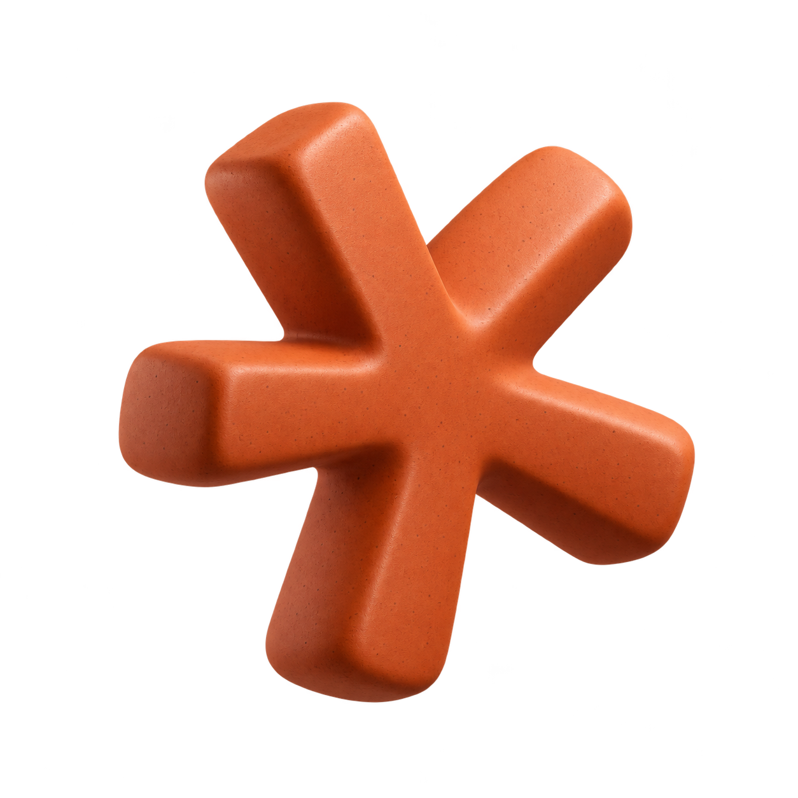
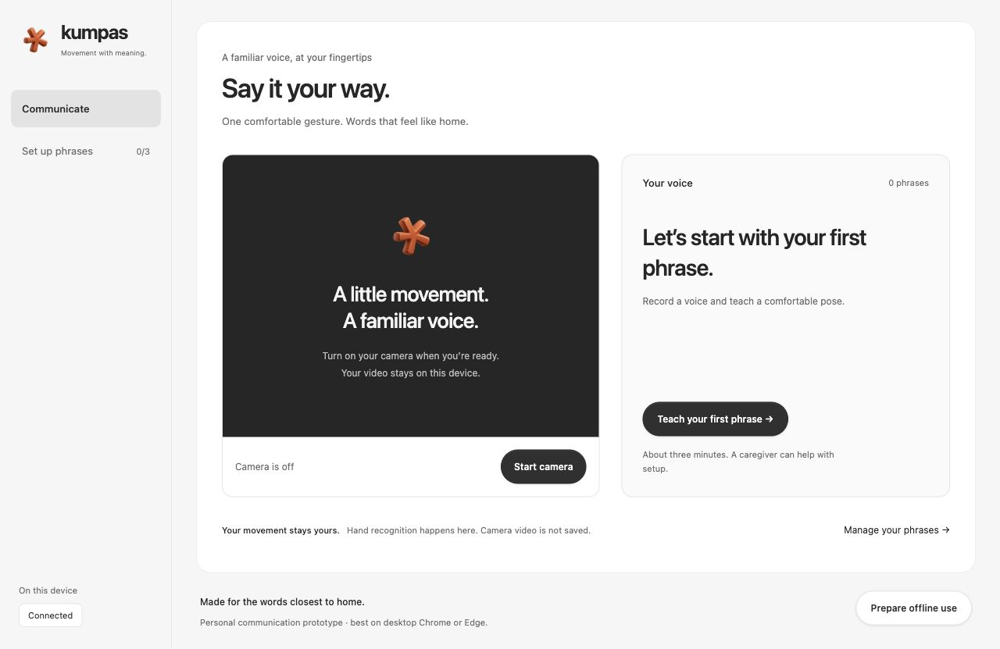

<p align="center">
  
</p>

<h1 align="center">Kumpas</h1>
<p align="center">Personal gestures. Familiar voices. Kahit walang internet.</p>

<p align="center">
  
  
  
  
  
</p>

Kumpas helps Filipino families turn personally chosen hand poses into everyday communication. Enter a phrase, record a familiar voice, and teach the device a comfortable pose. When that pose is recognized and held briefly, Kumpas displays the phrase and plays the recording once.

**“Ituro ang kumpas. Marinig ang boses ng pamilya. Kahit walang internet.”**

This is a personal phrase communicator, not Filipino Sign Language translation. The prototype is intended for a person who can intentionally repeat distinct hand poses, with a family member helping during setup. Practical accessibility and intended-user suitability still need validation.

## Team

**Techknights** · AppBuildersPH Local AI Hackathon 2026

- Joshua Sarmiento
- John Cedrick P. Siega
- Kc A. Sarmiento

## What it does

- Saves up to three personal phrases on one browser profile.
- Records up to eight seconds of an actual family member's voice per phrase.
- Supports recordings in any spoken language; no speech transcription or synthesized voice is required.
- Collects three separate attempts of a one-hand static pose, with eight feature examples per attempt.
- Runs a fresh pose test and a release check before saving a new mapping.
- Uses local hand landmark inference plus a small personalized classifier.
- Rejects distant or ambiguous matches instead of choosing the closest phrase unconditionally.
- Requires a short hold and a neutral release between automatic activations.
- Provides large manual phrase buttons, stop-audio controls, and a camera pause button.
- Stores phrase text, recordings, and gesture examples together in IndexedDB.
- Caches app, model, and runtime assets for offline use after initial setup.

Example phrases: **“Ma, pahingi ng tubig,” “Gusto kong magpahinga,”** and **“Pakatawag si Ate.”** The user chooses what each pose means; there is no prescribed sign vocabulary.

## Run locally

Use Node.js **22.21+**, pnpm **11.5.1**, and recent desktop Chrome or Edge. Initial dependency installation and model acquisition require internet. Camera and microphone access require browser permission and HTTPS or a supported localhost origin.

```sh
pnpm install --frozen-lockfile
pnpm prepare:model
pnpm build
pnpm start --host 127.0.0.1 --port 4175
```

Open **http://127.0.0.1:4175**. Keep the local preview process running for the supported demo path.

The repository includes the pinned model and runtime assets. `pnpm prepare:model` rebuilds the classic-worker runtime wrapper, copies matching WASM files, and verifies assets against [model-assets.json](docs/model-assets.json). It downloads the pinned model only when missing. Do not remove or regenerate the manifest to bypass an unexpected checksum failure.

For live code changes, use `pnpm dev`. Use the production build and preview for offline validation. After changes, rebuild and restart the preview, then click **Prepare offline use** again. The Cloudflare starter compatibility date is set to **2026-10-07**, matching the installed runtime's supported range.

### Teach a phrase

1. Open **Set up phrases** and click **Add a phrase**, or **Teach your first phrase**.
2. Enter the exact words the person would like to communicate.
3. Record and listen to a familiar voice saying the phrase.
4. Choose the hand that will be used and start the camera.
5. Collect a comfortable, distinct static pose in three separate attempts. Move the hand out of view between attempts.
6. Remove the hand, then repeat the pose for the fresh recognition test.
7. Hold a different relaxed pose with the same hand visible for the rejection check, then save. Removing your hand does not complete this check.

### Communicate

1. Open **Communicate**.
2. Tap a phrase once to check the speaker and enable audio playback.
3. Start the camera and hold an enrolled pose briefly.
4. Kumpas displays the recognized phrase and plays its saved recording once.
5. Relax or remove the hand before repeating or choosing another phrase.

Use the same enrolled hand and broadly similar camera orientation. If a pose overlaps an existing phrase, choose a more distinct pose and collect again.

## Why local AI?

Camera frames can reveal a person's home and family context. Kumpas processes frames in a browser worker rather than submitting them to a cloud AI API. The local vision model estimates hand geometry, and an example-based classifier maps that geometry to a personal phrase.

Local enrollment means a household can create a new mapping without remote training infrastructure. Recorded voice clips preserve familiar pronunciation and work without cloud text-to-speech. Phrase text, recordings, and feature examples stay in browser storage; camera video is not saved by the application.

### Test offline use

Click **Prepare offline use** while the production preview is running and reachable. This caches the application files, pinned model, and local runtime, then initializes the actual model and runs a blank-frame inference check. Wait for the completion message.

Disconnect external internet, reload the same URL, and try an enrolled phrase. Also test recording and enrolling a new phrase while disconnected. Keep localhost running for the normal live demo. Browser cache/storage can be cleared or evicted, so verify on the demo laptop before presenting.

The **Connected / Offline** label reflects the browser's connectivity signal; it is not a network audit or proof of model readiness. Hosted offline use requires its own validation. Deployment is not part of the verified delivery.

## Model and technology

| Component                                                                                                                     | Role                                                          |
| ----------------------------------------------------------------------------------------------------------------------------- | ------------------------------------------------------------- |
| [MediaPipe Hand Landmarker](https://ai.google.dev/edge/mediapipe/solutions/vision/hand_landmarker/web_js), float16 revision 1 | Existing pretrained model for hand landmarks                  |
| MediaPipe Tasks Vision **0.10.32**                                                                                            | Local CPU/WASM inference in a classic browser worker          |
| Custom normalized-feature classifier                                                                                          | Match personal examples with distance and ambiguity rejection |
| Hold/release state machine                                                                                                    | Gate intentional activation and prevent repeated playback     |
| MediaRecorder and HTML audio                                                                                                  | Record and play actual voice clips                            |
| IndexedDB                                                                                                                     | Atomic local phrase, recording, and example storage           |
| Service worker and Cache Storage                                                                                              | Versioned offline application/runtime assets                  |
| React, TypeScript, Vinext, Vite, Tailwind                                                                                     | Application, interface, and build tooling                     |
| Cloudflare starter tooling                                                                                                    | Local production preview and optional hosting configuration   |

We did not train the pretrained hand model. Enrollment stores normalized examples and calibrates a lightweight local classifier; it does not fine-tune MediaPipe. Match distance is not a calibrated probability and is not presented as a confidence percentage.

## Checks and demo preparation

```sh
pnpm typecheck
pnpm test
pnpm verify:assets
pnpm build
```

There are **28 automated tests** covering feature normalization, class rejection, continuous holding/release, audio cleanup, and atomic local storage behavior. Type checking and the production build were run during development. Browser checks verified the workspace, phrase/recording-step navigation, desktop and 390-pixel layout, and offline asset preparation. With the preview server stopped, the cached app reloaded and the actual cached model initialized and processed a blank frame. This verifies runtime operation, not pose accuracy.

These checks do not establish personal-gesture accuracy or intended-user suitability. A complete three-phrase enrollment, microphone recording, speaker playback, and live recognition trial still require hands-on acceptance on the demo device. See [validation notes](docs/validation.md) for the precise evidence and outstanding checks.

The [demo script](docs/demo-script.md) includes a five-minute live walkthrough, a failure recovery path, and the questions judges are likely to ask. The [development process](docs/DEVELOPMENT_PROCESS.md) contains scope, architecture, implementation stages, and validation criteria. [UI decisions](docs/ui-decisions.md) record how the provided reference projects informed Kumpas's interface.

## Interface preview



## Project structure

```text
app/          Page, layout, styles, and retained starter API route
components/   Workspace, phrase enrollment, and camera interface
lib/          Features, classifier, activation, audio, storage, offline setup
public/       Shared spark logo, local worker, model, WASM, and service worker
scripts/      Asset preparation, integrity checks, offline build manifest
tests/       Automated tests and synthetic feature fixtures
docs/        Model manifest, validation, demo script, UI decisions
```

## Limitations and disclosures

- This is a hackathon communication prototype. Recognition can miss poses or confuse similar ones; suitability for intended users has not been established.
- The supported scope is **three one-hand static poses**, using the enrolled hand. Dynamic gestures, two-hand signs, arbitrary sentences, and FSL translation are outside scope.
- Audio language flexibility comes from playing recordings. It does not imply language understanding or automatic translation.
- The hold/release timing and distance thresholds are development settings. Lighting, occlusion, camera position, motor variability, and pose choice affect recognition.
- Initial app/model setup needs internet or locally supplied assets. Offline use depends on a completed, verified cache setup and available browser storage.
- No cloud AI API, application analytics, or account service is used. Complete network privacy inspection remains outstanding; architecture alone is not an audit.
- Recordings and geometry examples are stored in the browser. They are not synchronized, encrypted with an application-managed key, or backed up by Kumpas.
- Deleting a phrase removes its application record and associated data. It is not a secure-erasure guarantee.
- Desktop Chrome/Edge is the target. Responsive layout checks do not establish mobile camera/runtime compatibility or broad browser support.
- MediaPipe runtime/model notices and the Apache license are retained under [public/models](public/models/NOTICE.txt). Runtime dependencies have their own licenses.
- Reused starter assets: the existing Vinext/React/Cloudflare scaffold. The orange spark logo was copied unchanged from **SafeShare** in `../hackathon2026/`, as requested; it was previously generated with **OpenAI ImageGen**.
- UI/UX references: the locally provided **Foglamp** and **Craft** projects in `../ui-design-inspo/`. Their neutral surfaces, app navigation, control depth, and spacing informed original Kumpas styles; reference application components were not copied.
- Application implementation and documentation were created during October 9, 2026 with **OpenAI Codex**. There is no runtime dependency on Codex or an OpenAI API.

## Recognition update — October 10, 2026

Saved gestures using the earlier feature format must be retaught with **Set up phrases → Edit & reteach**. Text and voice recordings are preserved, and manual phrase playback remains available. Do not delete your phrases to update them.

The matcher now uses wrist-centered 3D landmarks and checks each finger separately. Enrollment collects a continuous, steady pose in each of three independent attempts; movement, a missing hand, and frame gaps restart the current attempt. Calibration rejects inconsistent attempts instead of widening the acceptance range. Matching requires two attempts to support the result, absolute and relative separation from competing phrases, and distance from a recorded non-matching pose. Communication also requires settling before the activation hold.

After serving this build, refresh the app and run **Prepare offline use** again to update the cached app and worker. The thresholds are conservative development settings, not measured accuracy guarantees. Real-pose acceptance and false-trigger measurements remain pending.
