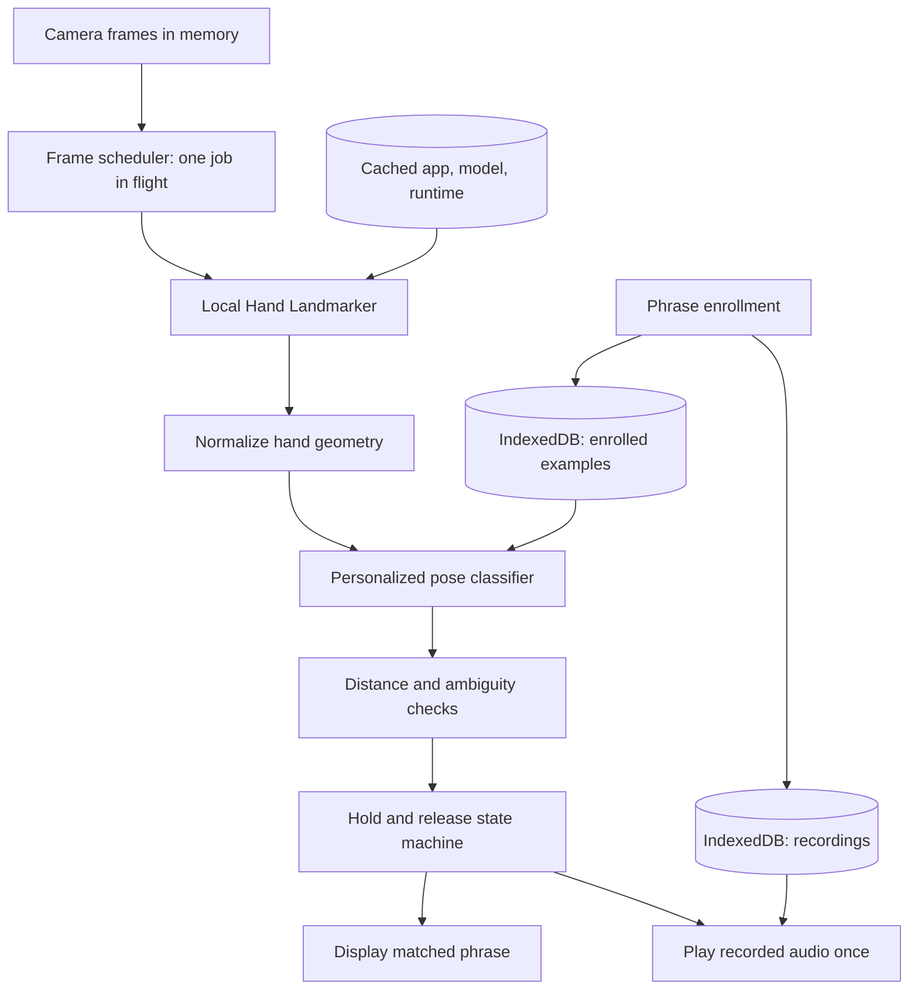

# Kumpas — Detailed Development Process

> Status: development plan and implementation record, October 9, 2026 (Asia/Manila).
> The local prototype is implemented. The stages and acceptance targets below remain a plan, not evidence that every target has passed. See [validation notes](docs/validation.md) for measured checks and remaining acceptance work.

## 1. Product definition

**Kumpas helps a person communicate familiar phrases through hand poses they choose, using local AI and a family member's recorded voice.**

Pitch: **“Ituro ang kumpas. Marinig ang boses ng pamilya. Kahit walang internet.”**

A family member enters a phrase, records its audio, and helps the user collect examples of a comfortable hand pose. During communication mode, the camera observes the user's hand. A local model extracts hand geometry; a personalized classifier compares it with enrolled examples. A stable, sufficiently distinct match displays the phrase and plays the recording once.

### Target user

An intended user is someone who cannot reliably communicate through speech, can intentionally make several distinct hand poses, and has a family member available for initial setup. This is a proposed user segment requiring feedback, not evidence that the prototype works for every person with a communication disability.

The caregiver configures Kumpas, but the communicating person chooses the phrases and movements wherever possible. Test whether a camera interaction actually reduces effort compared with large phrase buttons.

### Filipino context

- Phrases can use Tagalog, Cebuano, Ilocano, another language, or a household's mixed language.
- Recordings preserve familiar names and pronunciation: “Ma,” “Ate,” “Kuya,” or a person's nickname.
- Families can record the exact phrasing they use at home rather than selecting generic synthesized speech.
- Recognition and playback continue without cloud inference after the assets are installed.

Example phrases are suggestions for setup, not mandatory vocabulary:

| Phrase                   | Possible meaning        |
| ------------------------ | ----------------------- |
| “Ma, pahingi ng tubig.”  | Request water           |
| “Gusto kong magpahinga.” | Request a rest          |
| “Pakatawag si Ate.”      | Ask for a family member |

Use ordinary communication examples for the demo. Do not position the prototype as an emergency alert system.

### What makes the concept distinctive

The main interaction is **personal enrollment on the device**: a household maps its own comfortable poses to its own phrases and recordings. The stage demonstration can teach a new mapping while disconnected, then use it immediately.

This is a product hypothesis, not a claim of worldwide novelty. Gesture communication tools already exist. The submission should explain Kumpas's particular personalization workflow and show what was actually built.

### Scope boundaries

Kumpas is a personalized phrase communicator. The MVP does not translate Filipino Sign Language, interpret arbitrary gestures, understand sentences, clone voices, diagnose conditions, or guarantee recognition. Recorded audio does not require the app to understand the recording's language.

## 2. MVP contract

The complete happy path is:

**Create phrase → record voice → collect pose examples → test → save → recognize pose → play once → release → use another phrase.**

### Required for the hackathon

1. One local profile and up to three active phrases.
2. One visible hand at a time, using the enrolled hand.
3. Static poses; no movement sequences or two-hand signs.
4. Phrase text and a short recorded audio clip.
5. Multiple enrollment attempts per phrase.
6. A local personalized classifier with rejection of weak or ambiguous matches.
7. Hold-to-activate behavior and release-to-rearm behavior.
8. Large manual phrase buttons available when recognition is unsuitable.
9. Local persistence across reloads.
10. Offline model loading, enrollment, inference, and audio playback after setup.
11. Clear camera, microphone, model, and storage error states.
12. Reproducible setup instructions and truthful disclosures.

### Explicitly out of scope

Accounts, cloud sync, remote caregiver dashboards, payments, notifications, a marketplace of gestures, multilingual text generation, synthetic voices, mobile native packaging, advanced model training, and broad device compatibility claims.

### Definition of done

On the actual demo laptop, with external internet disconnected, a user can reload Kumpas, enroll and save three distinct poses with recordings, communicate each phrase, avoid repeated playback while holding a pose, release and repeat intentionally, and recover from an unknown pose without the app guessing a phrase.

Manual playback is an accessibility fallback. It does not count as evidence that AI recognition passes acceptance.

## 3. Existing repository and stack decisions

The starter currently uses Vinext, React, TypeScript, Tailwind, Vite, and Cloudflare tooling. Existing scripts are `pnpm dev`, `pnpm build`, `pnpm start`, and deployment scripts. Keep the starter; do not migrate frameworks for this prototype.

| Component                                        | Planned responsibility                                    |
| ------------------------------------------------ | --------------------------------------------------------- |
| React client components                          | Setup and communication interface                         |
| TypeScript                                       | Data contracts, classifier, lifecycle handling            |
| Tailwind and existing CSS                        | Responsive interface and readable controls                |
| `@mediapipe/tasks-vision`                        | Local hand landmark inference                             |
| Small custom classifier                          | Match normalized geometry to enrolled poses               |
| Dedicated worker, if supported on target browser | Run frame inference without stalling controls             |
| IndexedDB                                        | Phrase metadata, feature examples, audio blobs            |
| MediaRecorder                                    | Record actual household voice clips                       |
| HTML audio playback                              | Play saved clips after user enables audio                 |
| Service worker and Cache Storage                 | Offline application and runtime assets                    |
| Cloudflare, optional                             | Distribute application files; never process camera frames |

Do not use the starter's server API for gesture inference or phrase storage. Keep browser APIs out of server render paths. Import the vision runtime only inside client/worker initialization.

Pin a tested vision package version and its matching runtime assets. Record versions and checksums rather than importing `latest` from a CDN. Do not invent a version before testing compatibility.

## 4. Architecture and local AI boundary



### What runs locally

The pretrained hand landmark model runs on the user's device. Its outputs feed a local, example-based personalized classifier. Temporal activation logic and recorded audio playback also run locally.

Use accurate terminology: enrollment stores feature examples and fits a lightweight classifier; it does not retrain the pretrained vision network. Hand detection confidence is not the probability that a household phrase is correct.

### What needs internet

Initially: installing development dependencies and obtaining app/model/runtime files. A hosted first visit also needs connectivity. After verified asset setup, the core workflow should not need internet.

A localhost demonstration still requires the local server process to stay running. A cached hosted application has a different offline acceptance path and must be tested separately.

### Implementation basis

MediaPipe's [official web guide](https://ai.google.dev/edge/mediapipe/solutions/vision/hand_landmarker/web_js) documents local hand landmark inference, video mode, and synchronous inference calls. Its model returns 21 landmark points plus handedness. Because inference calls can block the UI thread, assess a worker on the target browser early.

Kumpas's normalization, classifier, rejection rules, and activation state machine below are proposed application design choices. They require validation rather than being guaranteed by MediaPipe.

## 5. Proposed file structure

Create files when their phase begins. Avoid implementing every module before the feasibility gate passes.

```text
app/
  page.tsx                         Client entry/workspace
  layout.tsx                       App shell and local font setup
  globals.css                      Tokens and global styles
components/
  setup/phrase-editor.tsx          Text, recording, enrollment, test
  setup/enrollment-camera.tsx      Guided capture
  communicate/communication.tsx    Main camera and phrase view
  communicate/phrase-button.tsx    Manual playback control
  shared/device-status.tsx         Camera/model/storage feedback
lib/
  types.ts                        Versioned data contracts
  vision/camera.ts                 Media stream lifecycle
  vision/features.ts               Landmark feature conversion
  vision/classifier.ts             Enrollment and matching
  vision/activation.ts             Hold/release state machine
  audio/recorder.ts                Recording and MIME handling
  audio/player.ts                  Playback and object URL lifecycle
  storage/database.ts             IndexedDB transactions
  offline/readiness.ts             Cache and model checks
workers/
  hand-inference.worker.ts         Vision initialization and inference
public/
  models/hand-landmarker/          Pinned model and notices
  mediapipe/wasm/                  Matching local runtime assets
  sw.js                           Versioned offline cache
scripts/
  prepare-model.mjs                Acquire and verify assets
  verify-assets.mjs                Check required local files
tests/
  features.test.ts
  classifier.test.ts
  activation.test.ts
  storage.test.ts
docs/
  model-assets.json                Versions, sources, hashes, licenses
  validation.md                   Hardware, method, actual results
  demo-script.md                  Five-minute pitch and backup path
DEVELOPMENT_PROCESS.md             This plan
README.md                         Run instructions and disclosures
```

## 6. Data model and persistence

Use one versioned IndexedDB database, for example `kumpas-v1`. A small wrapper is optional; never add a remote database for the core workflow.

```ts
type Phrase = {
  id: string;
  text: string;
  languageLabel?: string; // descriptive, not inferred from audio
  audioId: string;
  gestureId: string;
  enabled: boolean;
  createdAt: number;
  updatedAt: number;
};

type GestureExample = {
  id: string;
  gestureId: string;
  captureSessionId: string;
  handedness: "Left" | "Right";
  features: number[];
  featureVersion: number;
  capturedAt: number;
};

type AudioClip = {
  id: string;
  blob: Blob;
  mimeType: string;
  durationMs: number;
  createdAt: number;
};

type GestureCalibration = {
  gestureId: string;
  featureVersion: number;
  maxDistance: number;
  minMargin: number;
  calibratedAt: number;
};

type Settings = {
  schemaVersion: number;
  holdMs: number;
  releaseMs: number;
  enabledHand: "Left" | "Right";
  cameraDeviceId?: string;
};
```

Store audio blobs directly; do not convert recordings into large base64 strings. Keep object URLs transient and revoke them when replaced or unmounted. Raw camera frames stay in memory and are released after inference.

Draft enrollment remains separate from active phrases. Commit phrase, audio, examples, and calibration in one IndexedDB transaction. A failed save must preserve the previous working phrase rather than leave incomplete records. Deletion removes the related records and stops any active playback.

Check schema and feature versions before recognition. If normalization changes, existing examples need migration or reenrollment. Browser storage can be evicted; persistent storage requests are best effort, not a backup guarantee. See [MDN storage persistence](https://developer.mozilla.org/en-US/docs/Web/API/StorageManager/persist).

## 7. Camera and inference lifecycle

1. The user presses **Start camera**; do not request permissions during page load.
2. Request video only. Request microphone separately while recording.
3. Start with a moderate resolution, such as a preferred 640×480, and one hand. These are tuning choices.
4. Initialize locally hosted model/runtime assets and display a ready or error state.
5. Schedule roughly 10–15 processed frames per second initially; measure before increasing.
6. Permit only one inference job in flight. Drop stale frames rather than building a queue.
7. Use monotonic timestamps and avoid processing the same decoded video frame twice.
8. Ignore replies from stale sessions after pause, camera changes, or navigation.
9. Stop tracks, cancel scheduling, release frame resources, and close inference resources when leaving recognition.

In a worker implementation, transfer a supported frame representation such as an `ImageBitmap`, close it after processing, and send back only landmarks/status/timing. Verify worker and rendering support early. If a worker proves incompatible, a measured, throttled main-thread path is a prototype fallback; record its UI responsiveness limits.

Preview mirroring must not silently alter the feature input. Keep camera coordinates and handedness consistent between enrollment and recognition. Reject the wrong enrolled hand for the initial MVP instead of claiming hand-independent recognition.

Camera and microphone APIs need a secure context and browser permission. Use HTTPS or a verified localhost origin. A phone visiting a laptop's plain HTTP LAN address is not an equivalent camera setup. See [MDN getUserMedia](https://developer.mozilla.org/en-US/docs/Web/API/MediaDevices/getUserMedia).

## 8. Feature engineering

### Initial feature representation

Use aspect-corrected image coordinates before deriving distances: convert normalized x/y to an isotropic coordinate space using frame dimensions. Otherwise a camera aspect-ratio change distorts geometry.

For each usable hand:

1. Subtract the wrist position from each landmark.
2. Scale by a stable palm size estimate, such as wrist-to-middle-finger MCP distance.
3. Reject degenerate scales, invalid numbers, missing points, or unreliable detections.
4. Rotate the 2D coordinates so the wrist-to-middle-MCP direction has a consistent orientation.
5. Initially flatten normalized x/y coordinates into a fixed-length vector.
6. Keep a `featureVersion` alongside every example and calibration record.

This is intended to reduce sensitivity to translation, distance, and in-plane rotation. It does not guarantee robustness to occlusion, strong depth rotation, or different anatomy.

If two poses collide after normalization, ask for more distinct poses or retain a deliberate orientation feature. Do not add depth coordinates or complex features without evidence that they improve held-out recognition.

### Initial personalized classifier

Use a small nearest-neighbor classifier over saved feature examples. With three classes and modest enrollment data, this is easy to inspect and runs locally without a second neural model.

- Use normalized Euclidean distance as the initial metric.
- Calculate a class distance from several nearest examples, not a single accidental frame.
- Identify the best class and runner-up.
- Accept only if the best distance is below the class threshold and sufficiently separated from the runner-up.
- Return `unknown` when no class passes; reject ties deterministically.
- For a single enrolled class, require distance acceptance but do not invent a runner-up margin.

Do not display a fabricated confidence percentage. Show “Recognized,” “Keep holding,” “Not sure,” or “Try again.” A developer panel may show distances and thresholds for inspection.

### Calibration

Choose thresholds from separate enrollment attempts and negative poses. Do not split adjacent frames of the same held pose into training and testing, since that inflates performance.

Use per-class distance limits based on observed positive variation, plus a margin requirement checked against other classes. Include unrelated poses and relaxed-hand examples. If positives and negatives overlap, require reenrollment or a different pose rather than merely widening acceptance.

Threshold changes should be deliberate and recorded. The production UI should offer “Teach again,” not a confusing collection of numerical settings.

## 9. Enrollment workflow

### Step A — Enter phrase

Show a short phrase field with editable examples. Preserve Unicode and household names. Explain that the person using Kumpas should choose the message where possible.

### Step B — Record the voice

1. Ask for microphone access after **Record** is pressed.
2. Select a supported recording MIME type at runtime.
3. Display an unmistakable recording indicator and stop control.
4. Start with a proposed maximum duration of eight seconds.
5. Stop microphone tracks immediately after recording ends.
6. Wait for recording completion events before assembling the blob.
7. Offer playback and rerecording; reject empty or undecodable clips.
8. Keep the current saved clip until the replacement is successfully committed.

Use [MediaRecorder](https://developer.mozilla.org/en-US/docs/Web/API/MediaRecorder) for capture. Feature-detect format support and test playback on the demo browser; format availability differs between browsers.

### Step C — Choose a comfortable pose

Show one clear hand in the camera preview. Ask the user to choose a pose they can repeat comfortably. Avoid prescribing specific finger movements as universally usable.

Collect approximately three separate attempts per phrase, with a release between attempts and several accepted samples within each. These are starting collection settings, not proven requirements. Exclude no-hand frames, transition frames, and unstable detections.

Provide plain guidance: “Keep one hand visible,” “Hold comfortably,” and “Relax, then try again.” Do not make capture progress depend on dozens of almost identical frames.

### Step D — Test independently

After collection, ask the user to release and repeat the pose in a fresh trial. Verify the intended class wins and remains distinct from existing phrases. Include a neutral pose test. Save only when phrase text, playable audio, examples, and basic separability checks pass.

### Step E — Confirm and persist

Show the phrase and playback preview. Save all related records atomically. Verify that a reload restores the mapping. Do not seed prerecorded gestures and present them as learned during the live demonstration.

## 10. Activation state machine

Classification alone must never directly trigger sound on every frame.

| State               | Behavior                              | Transition                                 |
| ------------------- | ------------------------------------- | ------------------------------------------ |
| `paused`            | No automatic recognition output       | Explicit Start enters listening            |
| `listening`         | Wait for an accepted class            | Accepted class enters candidate            |
| `candidate`         | Show phrase and hold progress         | Stable duration passes, or evidence resets |
| `playing`           | Emit one playback event               | Finish/error enters waiting for release    |
| `waitingForRelease` | Suppress repeated activation          | Sustained neutral/no-hand input rearms     |
| `error`             | Explain fault; offer manual use/retry | Recovery resets session                    |

Initial tuning proposal: a 700 ms hold and a 400 ms release. Measure comfort and responsiveness; these are not validated defaults.

Rules:

- A class change resets hold progress.
- Unknown, wrong-hand, stale, or missing observations reset the candidate.
- Long gaps in processing cannot count as continuous holding.
- Use monotonic elapsed time with a maximum permitted observation gap; do not count frames as milliseconds.
- Holding the same pose after playback never repeats audio.
- Require an intentional neutral release before any next automatic phrase, including a different one.
- Playback rejection enters a clear error/rearm path; it cannot create a retry loop.
- Stop or navigation invalidates outstanding inference and playback events.
- Manual playback cancels the automatic candidate and requires release before rearming.
- Provide **Stop audio** and **Pause camera** controls.

The app should require an explicit **Enable sound / Start communicating** interaction and perform a real audio check. Handle a rejected playback promise; browser audio policy must not silently mute the demonstration.

## 11. Interface requirements

Use two modes: **Set up phrases** and **Communicate**. Setup may assume caregiver assistance; communication should expose few large controls.

### Setup mode

Phrase cards show text, a voice preview, enrollment status, and edit/reteach/delete actions. The enrollment panel presents one step at a time. Keep camera, audio, and save errors near their corresponding controls.

### Communication mode

- Large phrase text and clear playback status.
- Camera preview with an optional hand guide.
- Distinct listening, holding, speaking, and release states.
- Three large manual phrase buttons.
- Easily reached pause and stop controls.
- A compact offline/model readiness status.
- Camera hardware/backend details in a diagnostics panel, not the primary flow.

Support keyboard operation, visible focus, readable contrast, and meaningful accessible labels. Avoid announcing live landmarks or every recognition frame to screen readers. Respect reduced motion and never require color alone to distinguish states.

Avoid treating the skeleton overlay as the product. It is useful for diagnostics; the phrase and successful communication are the primary result.

## 12. Offline assets and privacy verification

### Asset preparation

Create an asset manifest containing package version, model source/revision, file sizes, hashes, and applicable licenses. Copy the matching WASM runtime files from the pinned installed package and acquire the model from its documented source. Verify binary content and hashes; an HTML download error must not be accepted as a model.

Bundle scripts and fonts locally. Inspect runtime fetches to discover all files the selected backend loads. Preserve model/package attribution and verify redistribution terms before shipping.

### Offline setup

Provide a deliberate **Prepare offline use** action:

1. Cache the built navigation shell and its required client assets.
2. Cache model and matching runtime assets.
3. Verify cache presence and successful local model initialization.
4. Request persistent storage where available, without treating approval as guaranteed.
5. Display ready only when setup succeeds; distinguish asset readiness from live camera recognition.

Version caches and model/runtime compatibility together. Do not delete a working cache before the replacement is complete. Avoid activating a new service worker in the middle of capture. Test the actual Vinext production navigation and chunk requests; caching only `/` and the model is not sufficient evidence of offline reload support.

### Two separate acceptance paths

**Localhost:** install and build online, start the local preview, prepare assets, disconnect external internet, reload the same origin, and keep the local process running. Verify preview behavior rather than assuming the development server represents production.

**Hosted:** load over HTTPS, complete asset setup, ensure the page is controlled by the service worker, disconnect, then reload and repeat enrollment/recognition. Avoid server-dependent navigation or API calls. If hosted offline operation fails, document the local demo path accurately.

### Data boundaries

- Camera frames are transient inputs, not stored videos.
- Voice recordings and feature examples stay in local browser storage.
- Core interactions must send no frame, phrase, recording, or landmark payload to an external service.
- Do not add third-party analytics or CDN runtime dependencies.
- Test network traffic before claiming privacy. A local architecture alone is not a completed network audit.
- Explain that deleting app records is not a promise of secure erasure from browser or device backups.

## 13. Implementation phases and build gates

The deadline in the repository brief is **October 10, 2026 at 10:00 AM Asia/Manila**. Allocate time backward from submission. Recheck remaining time before starting optional work; the estimates below are planning ranges, not guarantees.

### Phase 0 — Lock scope and baseline (15–20 minutes)

- Inspect starter scripts and check that the unmodified app builds.
- Record current package versions, device, browser, and available camera/microphone.
- Choose the single demo origin and laptop.
- Write the happy path and three example phrases.
- Add a short decision log; disclose reused starter code.

**Gate:** working starter, confirmed device permissions, and no unresolved stack migration.

### Phase 1 — Local vision feasibility (30–45 minutes)

- Install and pin the vision runtime.
- Add local model and runtime assets.
- Display camera preview and hand landmarks.
- Exercise pause, restart, denied permission, and cleanup.
- Measure detection duration and control responsiveness.
- Try the worker path and select the supported backend.

**Gate:** stable landmarks for the intended poses under the actual camera and ordinary room lighting. If this fails, simplify the pose set or target setup before building the full interface.

### Phase 2 — Personalized recognition (45–60 minutes)

- Implement pure feature normalization and nearest-neighbor matching.
- Collect three pose classes over separate capture attempts.
- Add unknown rejection and class margin checks.
- Run fresh trials and negative poses.
- Record failures and adjust enrollment or features based on evidence.

**Gate:** distinguish the three enrolled poses and reject unrelated input in fresh trials. Do not proceed on impressive training-frame accuracy alone.

### Phase 3 — Recording and local storage (30–45 minutes)

- Implement record, stop, preview, rerecord, and permission errors.
- Store audio blobs, examples, metadata, and calibration atomically.
- Verify reload and edit/delete behavior.
- Establish explicit audio enablement and clean playback lifecycle.

**Gate:** a saved phrase and recording survive reload and play on demand.

### Phase 4 — Complete communication loop (45–60 minutes)

- Connect accepted predictions to the hold/release state machine.
- Add single playback, stop, manual phrase buttons, and pause.
- Suppress duplicate or stale events.
- Make states visually clear without tuning controls in the primary flow.

**Gate:** repeated intentional communication works without playback spam or guesses on unknown input.

### Phase 5 — Offline production path (30–45 minutes)

- Build and inspect production assets and runtime requests.
- Implement cache preparation and readiness checks.
- Test disconnected reload, new enrollment, inference, and playback.
- Verify microphone and camera operation on the chosen origin.

**Gate:** the complete happy path works while disconnected, not just an already-open page with assets in memory.

### Phase 6 — Validation and focused polish (45–60 minutes)

- Run targeted tests and the manual matrix below.
- Improve only issues affecting comprehension, operation, and demo reliability.
- Test a new pose chosen by someone who has not enrolled it before, within event rules.
- Record actual measurements and limitations.

**Gate:** accepted failures are documented; material reliability failures are fixed or scope is reduced.

### Phase 7 — Package and freeze (reserve at least 45 minutes)

- Complete README, model manifest, validation notes, and disclosure list.
- Record the approximately one-minute demo video requested by the brief.
- Prepare the live script and a clearly labeled backup recording.
- Verify submission fields and public repository requirements.
- Submit once before the deadline and freeze code according to the brief.

Do not spend this reserved time adding themes, gestures, dashboards, or animation.

## 14. Testing strategy

### Automated tests that protect behavior

Add test tooling only when implementation begins. These scripts do not exist in the starter yet; introduce `typecheck`, `test`, and an asset verification command explicitly.

| Area              | Meaningful assertions                                                                             |
| ----------------- | ------------------------------------------------------------------------------------------------- |
| Features          | Translation/scale normalization, aspect correction, degenerate rejection, fixed dimensions        |
| Classifier        | Intended class, distant unknowns, ambiguous rejection, ties, single class, version mismatch       |
| Activation        | Short hold rejected, stable hold fires once, gaps reset, release rearms, pause invalidates events |
| Audio integration | Rejected playback handled, stop cancels, no repeated automatic retries                            |
| Storage           | Atomic save, reload reconstruction, deletion of related records, failed update preserves old data |
| Assets            | Required files exist, hashes match, manifest/backend assets agree                                 |

Synthetic feature tests prove classifier mechanics; they do not establish real-camera accuracy. Unit tests cannot prove actual browser media permission, audio policy, or service worker behavior.

### Manual validation matrix

| Scenario                                   | Expected outcome                                          |
| ------------------------------------------ | --------------------------------------------------------- |
| Fresh setup                                | Clear model preparation and permission prompts            |
| Denied camera                              | Useful retry/manual communication state                   |
| Denied microphone                          | Recording error; saved phrases remain usable              |
| No hand / wrong hand / two hands           | No phrase activation; clear guidance                      |
| Unenrolled pose                            | Unknown; no audio                                         |
| Similar enrolled poses                     | Enrollment warning or rejection; no confident guess       |
| Hold one pose for ten seconds              | One playback only                                         |
| Release and repeat                         | One additional intentional playback                       |
| Switch poses without release               | No new activation until rearmed                           |
| Pause during candidate or playback         | Candidate canceled; media cleanup follows controls        |
| Background tab / delayed frames            | No stale activation on return                             |
| Reload                                     | Saved phrases, recordings, examples, calibration restored |
| Disconnected reload                        | Local setup and communication still work                  |
| Disconnected new enrollment                | New phrase and clip can be saved and recognized           |
| Deleted phrase                             | No ghost match or orphan playback                         |
| Reduced lighting / changed camera distance | Measure degradation; reject weak observations             |
| Storage full or unavailable                | Honest error; no false saved status                       |
| Audio blocked or output muted              | Visible feedback and explicit audio check                 |

### Evaluation protocol

Enroll and evaluate in separate sessions. For each phrase, collect ten fresh trials, with a neutral release between trials. Add at least twenty negative trials using unrelated poses and a two-minute idle/ordinary-hand-motion period. Repeat a subset under different lighting and camera distance.

Record trial labels, observed outputs, no-output events, and timings without retaining raw camera footage unless separately agreed for testing. Each intended user needs their own enrollment; success on a developer's hand is not user validation.

Report:

- Correct activations / attempted positive trials.
- Wrong-phrase activations / attempted positive trials.
- Misses / attempted positive trials.
- False activations / negative trials, plus idle observation duration.
- Median and p95 inference duration, with sample count.
- Median and p95 intentional-pose-to-audio delay, including the hold duration.
- Offline reload/enrollment results and exact tested environment.

Proposed internal release goals: at least 27 correct outputs across 30 positive trials, no wrong-phrase output, no activation across the 20 negative trials or idle period, and repeatable offline acceptance. These are small-sample development gates, not proof of real-world reliability or a published accuracy claim. Report the actual numbers even if the goals are missed.

If a gate fails, prefer collecting better separated examples, changing overlapping poses, or reducing scope over loosening all thresholds.

## 15. Risks, recovery, and scope cuts

| Risk                              | First response                                            | Honest fallback                               |
| --------------------------------- | --------------------------------------------------------- | --------------------------------------------- |
| Similar poses collide             | Fresh attempts, stronger rejection, different pose choice | Fewer active phrases                          |
| User cannot comfortably hold pose | Adjust hold based on feedback                             | Manual phrase board; disclose limits          |
| Low lighting or occlusion         | Improve placement and guidance                            | Reject observations rather than guess         |
| Worker/backend incompatibility    | Verify local assets and target browser                    | Throttled measured main-thread path           |
| Recording format mismatch         | Runtime MIME checks and playback test                     | Rerecord using supported format               |
| Offline hosted reload fails       | Inspect navigation/chunk caches                           | Verified localhost path with instructions     |
| Browser storage eviction          | Persistent-storage request and clear explanation          | Reenrollment; export/restore is later work    |
| Stage camera or audio fault       | Retry once and show status                                | Labeled backup video, not simulated inference |

Cut decorative animation, additional languages in the interface, multiple profiles, import/export, install prompts, and hosted deployment before cutting recognition rejection, release gating, storage correctness, or offline proof.

## 16. Five-minute live demo

| Time      | What to show                                                                       |
| --------- | ---------------------------------------------------------------------------------- |
| 0:00–0:35 | Describe one household communication situation and intended user                   |
| 0:35–1:05 | Show three family phrases and one recorded voice                                   |
| 1:05–1:25 | Disconnect external internet and identify the local runtime                        |
| 1:25–2:35 | Choose a distinct new pose, record a short phrase, collect examples, test and save |
| 2:35–3:20 | Activate the new phrase; hold it to show no repeated speech; release and repeat    |
| 3:20–3:45 | Show unknown-pose rejection and manual phrase access                               |
| 3:45–4:15 | Reload offline and demonstrate the saved mapping                                   |
| 4:15–5:00 | Explain architecture, measured results, limitations, and next validation step      |

Rehearse with a timed run. A judge-chosen pose adds credibility but must stay within the supported one-hand static-pose scope. Explain if two poses are too similar. Never secretly swap in hardcoded recognition.

### Judge Q&A preparation

**What is AI here?** The pretrained local vision model estimates hand landmarks; a locally fitted example-based classifier maps geometry to personal phrases. The audio is a recording, not generated speech.

**Why local?** Continuous camera input and household recordings stay on the device, and recognition/enrollment remain usable without cloud inference after setup.

**Is this FSL translation?** No. The prototype recognizes a small set of personally enrolled static poses. Full sign language includes linguistic and motion information outside this scope.

**Does it work for everyone?** No such claim has been validated. State the tested users, hardware, poses, and failure conditions.

**What happens when it is unsure?** It rejects the match, displays guidance, and retains manual phrase controls.

**What did you build?** Enrollment, normalization/classification, rejection and activation logic, recordings, persistence, interface, and offline asset workflow. Disclose the pretrained model and starter separately.

## 17. Documentation and evidence to produce

### README

- Product purpose and supported scope.
- Exact install, model preparation, build, and preview commands after verification.
- Tested browser/device and permission instructions.
- Online first setup versus disconnected use.
- What runs locally and what requires internet.
- Known recognition, storage, audio, and accessibility limits.
- Models, licenses, packages, APIs, cloud hosting, reused assets, and AI development tools.

### Validation log

Use this template in `docs/validation.md` when testing starts:

```markdown
## Run: [date/time Asia/Manila]

- Commit/build:
- Device, OS, browser version:
- Camera, lighting, distance, enrolled hand:
- Model/package revision and backend:
- Enrollment sessions and sample counts:
- Positive trial results:
- Negative trial results and idle duration:
- Inference and activation timing method/results:
- Offline reload and new enrollment:
- Network inspection findings:
- Failures, adjustments, remaining limitations:
```

Keep measurements reproducible. Do not write invented benchmarks, retroactively mark planned work complete, or claim meaningful intended-user validation from a developer-only demo.

### Development decision log

For each major change, capture the problem, chosen approach, evidence, and consequence. Examples: worker versus main thread; normalization change; rejection threshold adjustment; target browser selection; localhost versus hosted offline support.

### Submission checks

Use `../AppBuildersPH.md` and official event announcements for the final requirements. The local brief currently calls for a public repository, project/team details, a demo video and social video URL, local/internet boundaries, and full tool/model disclosures. Verify these before the one-time submission.

Disclose AI-assisted development accurately, including Codex and any other tool actually used. Disclose starter code and external model assets. Keep all required licenses/notices with redistributed files.

## 18. Completion checklist

- [ ] Existing starter builds and target browser/device are recorded.
- [ ] Model and matching runtime are pinned, self-hosted, and verified.
- [ ] Camera lifecycle and permission errors work.
- [ ] Feature representation is versioned and tested.
- [ ] Three phrases are enrolled through separate pose attempts.
- [ ] Unknown and ambiguous observations produce no phrase.
- [ ] Hold/release behavior prevents accidental repeated audio.
- [ ] Recorded clips play after explicit audio enablement.
- [ ] Manual communication, stop, and pause controls work.
- [ ] IndexedDB restores a consistent profile after reload.
- [ ] Delete, rerecord, and reteach preserve data integrity.
- [ ] Production offline reload, new enrollment, and communication pass.
- [ ] Network inspection supports the privacy claims.
- [ ] Actual evaluation results and limitations are documented.
- [ ] README, asset manifest, notices, and disclosures are complete.
- [ ] Demo laptop, speaker, camera, charger, and backup recording are checked.
- [ ] Submission is complete before October 10, 2026, 10:00 AM Asia/Manila.

## 19. After the hackathon

If the prototype passes, prioritize intended-user and caregiver feedback before expanding features. Learn whether pose choice, recording familiarity, camera placement, and hold duration support real communication. Compare with the manual phrase board and existing communication tools.

Potential later work includes explicit export/restore, more profiles, configurable activation methods, greater movement diversity, broader device testing, and collaboration with communication/accessibility specialists. Add features in response to observed needs; do not assume a larger vocabulary automatically improves the product.

## 20. Primary technical references

- [MediaPipe Hand Landmarker web implementation guide](https://ai.google.dev/edge/mediapipe/solutions/vision/hand_landmarker/web_js)
- [Google's Hand Landmarker web sample](https://github.com/google-ai-edge/mediapipe-samples/blob/main/examples/hand_landmarker/js/README.md)
- [MediaPipe web runtime and on-device processing](https://github.com/google-ai-edge/mediapipe/blob/master/mediapipe/tasks/web/vision/README.md)
- [MDN: camera/microphone access](https://developer.mozilla.org/en-US/docs/Web/API/MediaDevices/getUserMedia)
- [MDN: audio recording](https://developer.mozilla.org/en-US/docs/Web/API/MediaRecorder)
- [MDN: storage persistence requests](https://developer.mozilla.org/en-US/docs/Web/API/StorageManager/persist)

References support platform capabilities. Product behavior, numeric tuning values, effort estimates, and release gates in this document are proposed Kumpas engineering decisions requiring implementation and measurement.

## Implementation record — October 9, 2026

Implemented the communication workspace, three-step enrollment, family voice recording/playback, local hand-landmark worker, personalized classifier, hold/release activation, atomic IndexedDB storage, and versioned offline preparation. The interface uses the provided Foglamp/Craft direction and the reused SafeShare spark logo.

Type checking, 18 automated tests, asset integrity verification, and the production build pass. Browser checks cover desktop/mobile layout and setup navigation. With the production server stopped, the cached application reloads and the actual cached MediaPipe model initializes and processes a blank frame. These checks establish runtime operation, not real-gesture accuracy.

Full three-phrase enrollment, live microphone/speaker verification, pose recognition measurements, and intended-user feedback remain pending. See [validation notes](docs/validation.md) and the [demo script](docs/demo-script.md).
